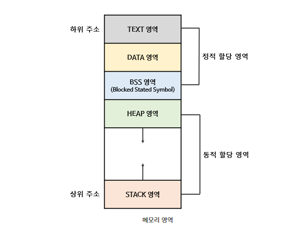
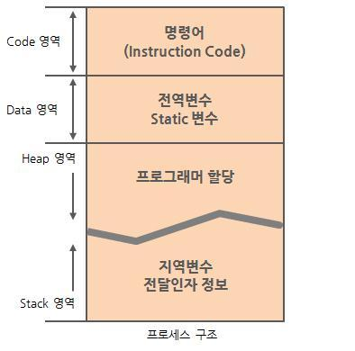
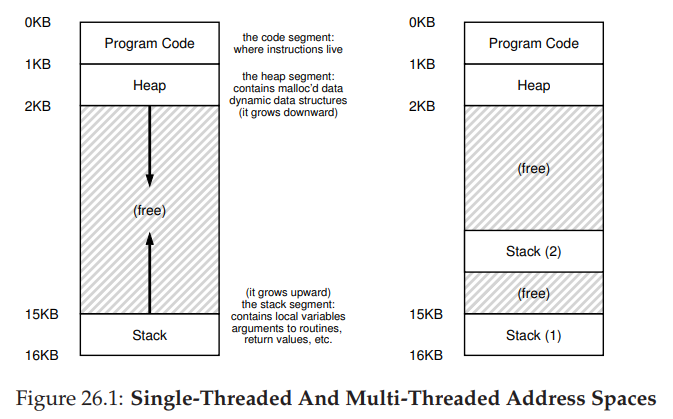
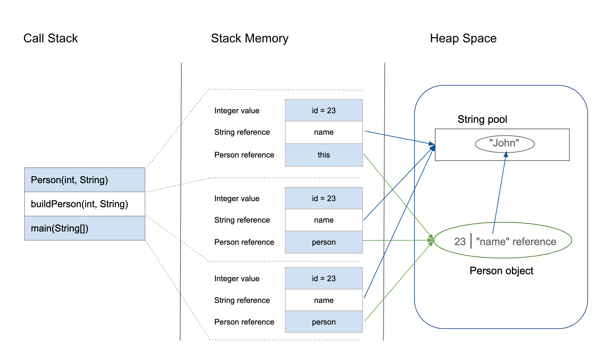

# 6th Meeting
* [페이징 & 세그먼테이션]()
* [프로세스 주소공간]()
* [PCB & 문맥 교환]()

---
## 프로세스 주소공간
@ 흐느

- 프로세스는 대해 운영체제가 자원을 할당하는 단위로 볼 수 있다.
- 프로세스에게 메모리를 할당하고 이를 관리하기 위해 메모리 공간을 특정한 구조로 관리하게 되는데 이를 가리켜 프로세스 주소 공간이라고 부른다.

### Text (Code) 영역:
- 프로그램이 실행될 수 있도록 CPU가 해석 가능한 기계어 코드가 저장되어 있는 공간으로, 프로그램이 수정되면 안 되므로 ReadOnly 상태로 저장 되어있다.
  
### Heap 영역:
- 런타임에 크기가 결정되는 영역이다.
- 사용자에 의해 공간이 동적으로 할당 및 해제된다. (malloc()이나 new를 사용하였을때)
- 주로 참조형 데이터 (ex. 클래스) 등의 데이터가 할당된다.
- 메모리의 낮은 주소에서 높은 주소의 방향으로 할당된다.
  
### Data 영역:
- 전역 변수나 Static 변수 등 프로그램이 사용할 수 있는 데이터를 저장하는 영역이다.
- 어떤 프로그램에 전역/static 변수를 참조하는 코드가 존재한다면, 이 프로그램은 컴파일 된 후에 data 영역을 참조하게 된다.
- 프로그램의 시작과 함께 할당되며, 프로그램이 종료되면 소멸한다.
- 단, 초기화 되지 않은 변수가 존재한다면, BSS 영역에 저장된다.
  
### Stack 영역:
- 함수의 호출과 관계되는 지역 변수와 매개변수가 저장되는 영역이다.
- Stack 영역의 값은 함수의 호출과 함께 할당되며, 함수의 호출이 완료되면 소멸한다.
- 메모리의 높은 주소에서 낮은 주소의 방향으로 할당된다.
- 재귀 함수가 너무 깊게 호출되거나 함수가 지역변수를 너무 많이 가지고 있어 stack 영역을 초과하면 stack overflow 에러가 발생한다.

### 멀티 스레드의 경우

- 하난의 프로세스 내에 존재하는 각 스레드들은 스택 영역 외 주소 공간을 공유한다.

### 힙과 스택의 관계 (JAVA)

- Stack 영역은 생성과 동시에 크기가 정해진다. 즉, 크기가 한 번 정해지면 바뀌지 않기 때문에, Heap 영역과 상관 없이 크기의 제한을 갖는다.
- Stack 영역에 등장하는 각각의 변수들은 Heap 영역에 위치한 실제 Object의 참조를 갖고 있는 것을 볼 수 있다. 즉, 실제 객체는 Heap 영역에서 관리되기 때문에 Stack 영역의 크기는 생각보다 클 필요가 없다는 것을 알 수 있다.

참고자료)
1. https://velog.io/@cef5787/%EC%9A%B4%EC%98%81%EC%B2%B4%EC%A0%9C-2.-%ED%94%84%EB%A1%9C%EC%84%B8%EC%8A%A4
2. https://velog.io/@klm03025/%EC%9A%B4%EC%98%81%EC%B2%B4%EC%A0%9C-%ED%94%84%EB%A1%9C%EC%84%B8%EC%8A%A4-%EC%A3%BC%EC%86%8C-%EA%B3%B5%EA%B0%84
---
## PCB & 문맥 교환
@ Ashe

---
## 페이징 & 세그먼테이션
@ 또로리

### **메모리의 주소공간**
- 논리 주소
- 물리 주소

### **MMU(Memory Management Unit)**
`논리 ---MMU---> 물리`  
메모리 관리자로서  
프로세스가 논리주소로 데이터 요청 시,  
OS가 해당 논리주소를 물리주소로 변환하기 위해 사용하는 하드웨어 장치

- 작업 종류  
  - 가져오기  
    데이터를 메모리로 가져오는 작업
    - 정책  
      프로세스가 필요로 하는 데이터를 언제 가져올지에 따라 구분됨
      - 프로세스가 요청할 때(fetch)
      - 필요하다고 예상될 때(prefetch)
  - 배치  
    메모리를 어느 크기로 자르고 어디다 올릴지 결정하는 작업
    - 정책  
    가져온 프로세스를 어느 크기로 자를지에 따라 구분됨
        - 페이징  
        메모리를 같은 크기로 자르는 것 (책의 모든 페이지가 같은 크기인 데서 유래)
        - 세그먼테이션  
        프로세스의 크기에 맞게 자르는 것
  - 재배치  
    꽉 차 있는 메모리에 새로운 프로세스를 가져오기 위해  
    오래된 프로세스를 하드디스크로 내보내는 작업
    - 정책  
      내보낼 프로세스를 선정하는 데에 다양한 교체알고리즘 이용

### **메모리 할당**
프로세스를 메모리 영역에 할당하는 것  
- 문제점 : 단편화  
  작은 조각들이 발생하는 현상으로서 메모리 낭비를 유발함
    - 내부 단편화(internal fragmentation)  
        빈 공간에 메모리를 할당하고 난 뒤에 딱 맞게 떨어지지 않고 남는 공간이 발생하는 현상
        - 비연속 메모리 할당에서 발생
    - 외부 단편화(external fragmentation)  
        작업에 충분한 메모리 공간이 남아있지만  
남은 메모리 공간이 조각조각 나눠져 있어서 메모리 할당 해줄 수 없는 현상  
(유휴 공간들을 모두 합치면 충분한 공간이 되지만  
그것들이 너무 작은 조각들로 여러 곳에 분산되어 있는 경우)  
        - 연속 메모리 할당에서 발생
        - 대안
          - 공간 통합
          - 메모리 압축
          - 비연속할당방식인 페이징 기법 사용
          - 조각모음
- 종류  
  - 비연속적(Non-contigous) 메모리 할당  
    프로세스의 크기에 상관 없이,  
    프로세스의 물리적 메모리  공간을 페이지라는 고정된 크기의 단위로 나누고  
    메모리에 띄엄띄엄 배치하는 방식.  
    - 용어  
        프로세스의 페이지는  
        파일 시스템 또는 예비 저장장치로부터 가용한 메인 메모리 프레임으로 적재되는 것이다.
      - 프레임  
        메모리를 나눈 조각  
        즉, 물리적 메모리--나눔-->고정 크기의 블럭  
      - 페이지  
        프로세스를 나눈 조각  
        논리적(가상) 메모리 --나눔-->고정 크기의 블럭  
    - 특징  
      - 외부단편화 문제 해결 가능  
      - 여러곳에 나눠져있는 공간 압축 불필요  
      - OS와 HW지원을 통한 구현  
        (프레임 크기와 페이지 크기는 HW에 의해 정해짐)
      - 논리 주소 공간과 물리 주소 공간이 완벽하게 분리  
        => 물리 주소를 고려하지 않고 프로그래밍 가능
      - 재진입코드일 경우 공통적인 코드는 공유 가능  
        => 메모리 낭비 방지 가능 
      - HW적 방법인 보호비트(유효-무효 비트 (valid-invalid bit))를 통해 메모리를 보호함
  
  - 연속적(Contiguous) 메모리 할당  
    프로세스를 메모리의 여러 곳에 나눠서 할당하지 않고  
    세그먼테이션(프로세스의 크기에 맞게 자르는 것)을
    다음 프로세스가 적재된 영역과 인접한 영역에 연속적으로 할당하는 기법
    - 특징
      - 필요한만큼 자르기 때문에 내부단편화는 없지만  
        중간중간 hole의 발생으로 외부단편화 발생
      - 각 파티션 당 하나의 프로세스만 적재 가능
      - OS는 사용 가능한 메모리 부분과 사용중인 부분을 나타내는 테이블을 유지
      - 처음에는 모든 메모리가 하나의 영역으로서 사용자 프로세스에 각각 할당 되고
프로세스가 종료되면 하나의 큰 사용 가능한 메모리 블록(hole)이 생성된다.  
⇒ 할당과 해제가 반복되며 빈 공간(파란색)인 hole이 발생  
프로세스가 시스템에 들어오면
OS는 각 프로세스가 얼마만큼의 메모리를 요구하고 현재 사용 가능한 메모리 공간이 얼마나 있는지를 고려하여 공간을 할당한다.
    - 종류
      - 최초 적합 (first-fit)
      - 최적 적합 (best-fit)
      - 최악 적합 (worst-fit) 
      - 순차 최초 적합